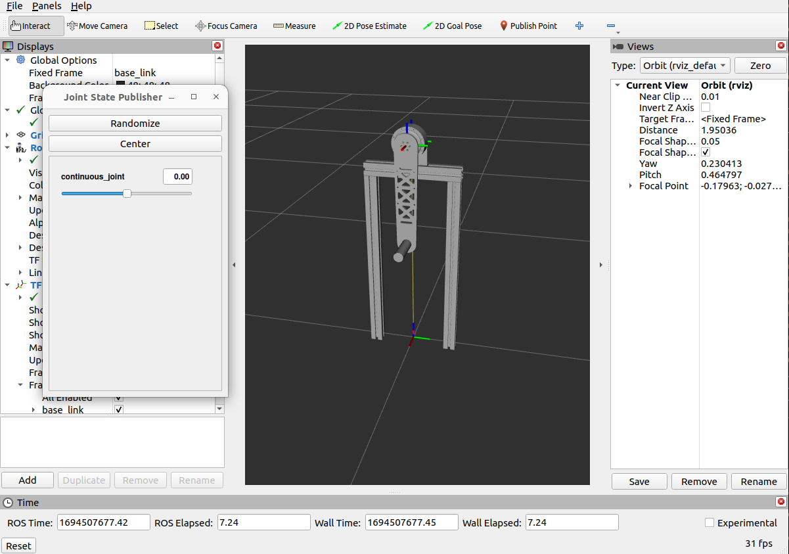
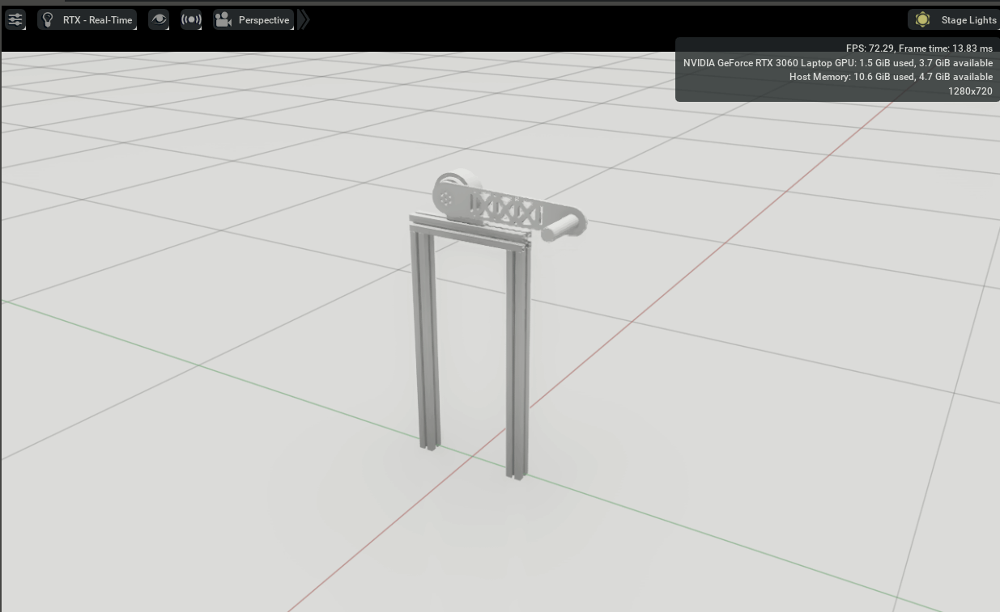

# Simple Pendulum Model for Isaac Sim based ros2_control

<p align="center">
    
</p>

```
xacro simple_pendulum_editted.xacro > simple_pendulum_editted.urdf
xacro simple_pendulum.xacro > simple_pendulum.urdf
```

```
ros2 topic pub  /joint_command sensor_msgs/msg/JointState "{name: ['continuous_joint'], position: [0.0], velocity: [1.0], effort: [0.0]}"
```

```
ros2 run joint_ctrl_example basic_ctrl 
```

<p align="center">
    
</p>

